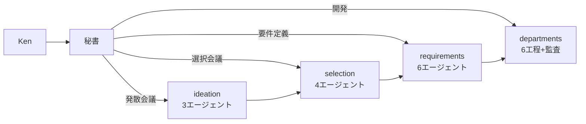

# Company Agents

Claude Code で動く仮想会社。Ken（CEO）が秘書に話しかけるだけで、会議と開発が回る。

---

## 30秒でわかる仕組み

```
Ken「発散会議を開いて」
  → 秘書が3人のエージェントを召喚 → アイデアを広げる

Ken「選択会議を開いて」
  → 秘書が4人のエージェントを召喚 → アイデアを検証・絞る

Ken「要件定義会議を開いて」
  → 秘書が6人のエージェントを召喚 → 仕様を固める

Ken「開発を始めて」
  → 秘書が1工程ずつロールを演じて開発 → 監査 → 次の工程
```

---

## フォルダ構成

```
company-agents/
│
├── cc-company/              ← 会社本体（共通リソース）
│   ├── README.md            　 組織図・エージェント一覧
│   ├── vision/              　 経営理念（mission / values / principles）
│   ├── secretary/           　 秘書室（窓口・記録）
│   ├── meetings/agents/     　 会議の定義（3種類）
│   ├── departments/         　 開発部署（6ロール）
│   ├── audit/               　 監査室
│   ├── templates/           　 テンプレート集
│   └── research/            　 リサーチスキル定義
│
├── product-template/        ← プロダクト雛形（コピーして使う）
│   ├── CLAUDE.md            　 ブートローダー
│   ├── meta.json            　 状態管理
│   ├── meetings/            　 会議ログ保存先
│   └── dev/                 　 開発成果物保存先
│
└── PRODUCT_WORKSPACE_SETUP.md ← セットアップ手順
```

---

## 使い方

### 1. このリポジトリをクローン

```bash
git clone git@github.com:kento20020/company-agents.git
```

### 2. プロダクトフォルダを作る

```bash
cp -r product-template/ product-my-app/
```

### 3. Vision を書く（任意）

`cc-company/vision/` の3ファイルにミッション・価値観・原則を記入。
空のままでも動くが、ビジョン番人が機能しない。

### 4. プロダクトフォルダで Claude Code を開く

```bash
cd product-my-app/
claude
```

秘書が起動し、指示を待つ。「発散会議を開いて」で開始。

---

## 全体フロー



---

## 設計原則

| # | 原則 |
|---|---|
| 1 | **Ken = CEO** — すべての会議はKenが起動。自動遷移なし |
| 2 | **秘書が唯一の窓口** — Kenは秘書にだけ話しかければよい |
| 3 | **会議と開発は分離** — 会議で決め、開発で作る。橋渡しは要件定義書のみ |
| 4 | **cc-company は参照のみ** — プロダクトフォルダから書き換えない |

---

## 詳細ドキュメント

- [cc-company/README.md](cc-company/README.md) — 組織図・全エージェントの振る舞い・リサーチ権限
- [PRODUCT_WORKSPACE_SETUP.md](PRODUCT_WORKSPACE_SETUP.md) — セットアップ手順
