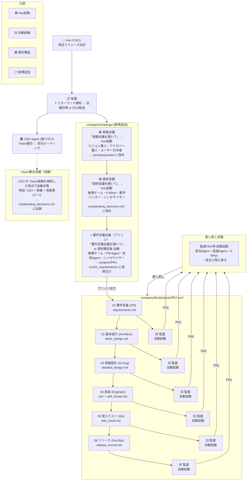
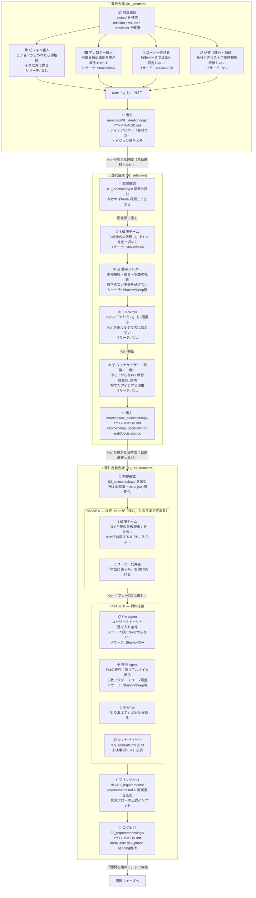
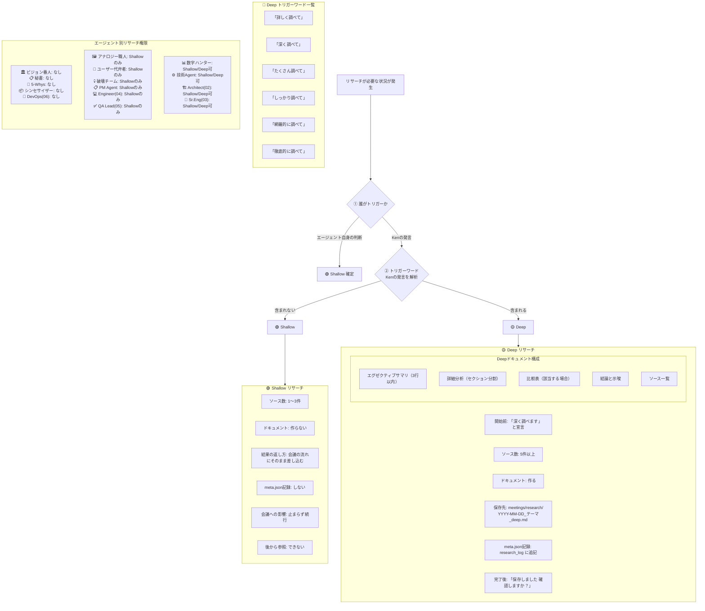

# CC Company × Product Workspace System

Ken を CEO とする仮想会社組織（cc-company）に、プロダクトごとの壁打ち会議と開発フローを統合したシステム。

## 構造

```
cc-company/          ← 会社共通リソース（参照のみ）
product-template/    ← プロダクトテンプレート（コピーして使う）
```

## 基本原則

- **1プロダクト = 1フォルダ**（完全自己完結）
- **Ken = CEO**（全会議はKen起動・自動遷移なし）
- **秘書が唯一の窓口**（トリガーワード検知 → エージェント召喚）
- **会議と開発は分離**（橋渡しは要件定義の出力のみ）

---

## 全体アーキテクチャ



---

## 会議の機能フロー — 3つの会議と内部エージェント



---

## リサーチフロー — Shallow / Deep 判断と実行



> ★ エージェント側から Deep を起動することはできない

---

## 秘書が検知するトリガーワード一覧

| Ken発言 | 起動タイプ | 参加エージェント → 出力先 |
|---|---|---|
| 「発散会議を開いて」 | Ken起動 | ビジョン番人・アナロジー・ユーザー代弁者 → secretary/notes/ |
| 「選択会議を開いて」 | Ken起動 | 破壊・5-Whys・数字ハンター・まとめ役 → ceo/pending_decisions.md |
| 「要件定義会議を開いて」 | Ken起動 or 選択後自動 | 破壊・PM Agent・技術Agent・まとめ役 → 01_requirements/ |
| 監査FAIL検知（自動） | システム自動 | 担当Agent + 監査 + 5-Whys → 該当工程に差し戻し |
| Vision抵触検知（自動） | システム自動 | CEO + 秘書 + 発案者ロール → ceo/pending_decisions.md |
| 「議題Xで会議を開いて」 | Ken起動（カスタム） | 秘書がアジェンダ解析 → 最適エージェント自動選定 |

> ★ 要件定義会議の出力が dev/projects/ の 01_requirements/ に直接書き込まれることで、既存ウォーターフォールフローに自然に接続される

---

## 使い方

1. `product-template/` をコピーして `product-xxx/` を作成
2. `PRODUCT_WORKSPACE_SETUP.md` の手順に従ってセットアップ
3. 「発散会議を開いて」で壁打ち開始

## ステータス

🚧 構造確定済み・プロンプト本文は未実装
